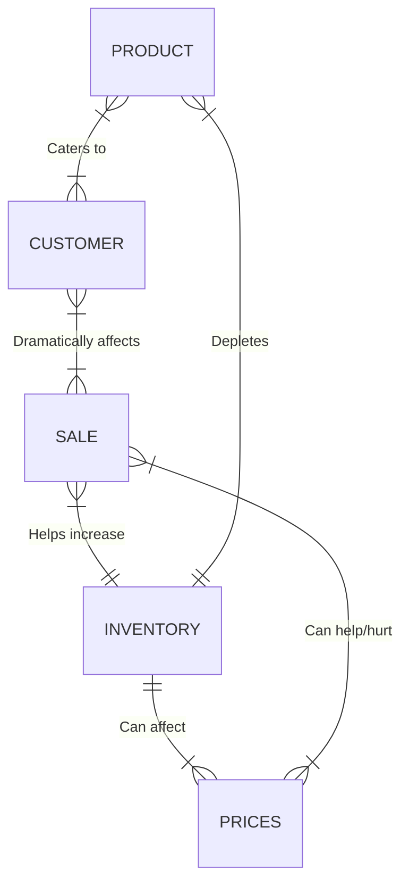

### THE DIAGRAM
One or many different shoe products caters to one or many customers. One or Many customers dramatically impacts one or many different shoe sales. One or many sales ends up depleting one and only one inventory. One and only one inventory can affect one or many prices. One or many different shoe prices can either help or hurt the sales of those products
#### PRODUCT
The product is what is being sold by Nike, which  in this case is their AirMax shoe line. The product and how it appeals to customers and different demographics is crutial for successful sales. As shown in the diagram, one or many products made caters to one or many customers and one or many sold will deplete the inventory.
#### CUSTOMER
The customer is who Nike is trying to sell their shoes to. It is extremely important to know your customers and what they want in the product so that they are more likely to purchase it. In the diagram, one or many customers can dramatically impact one or many sales depending on many different factors
#### SALE
Sales are the result of selling a product. Depending on pricing and how well recieved the product is, sales will increase or decrease. In the diagram, sales can be helped or hurt by prices, are dramatically influenced by customers, and can be used to replenish inventory when resources are low.
#### INVENTORY
Inventory is where resources used to make different shoes are managed, stored, and tracked on a constant basis. It is critical to keep resources well managed and well stocked in order not to harm production time or potential gains in sales. In the diagram, Inventory is depleted by one or many products, can help increase sales, and can cause one or many prices to increase when depleted enough.
